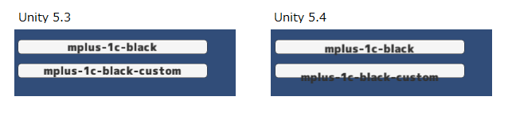
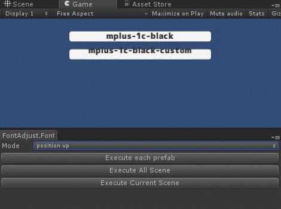
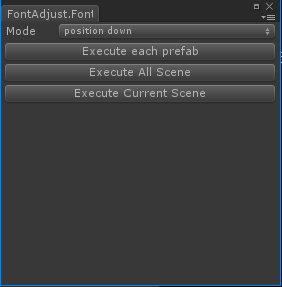
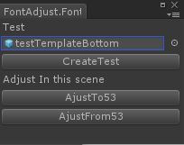

# FontAdjust について
Unity5.3系→5.4等に移行すると、UguiのTextが Y方向にずれてしまう問題があります。 

5.3ベースで作成していただいた方々が、5.4以降にスムーズに移行する手助けのため、本ツールを用意させていただきました。 

下記のような形で動作いたします 
  

※1.フォントのデータ次第で、ずれ方が違っておりましたため 全てカバーしきれるかはわかりません。 
※2.また複数行ある場合などでの動作も保証は出来ない状態になっております。 

# 使用方法等

FontAdjust.unitypackage をプロジェクトにインポートすることで必要なものが入ります。 

メニューの Tools/FontAdjust/FontAdjustWindowを呼び出すと下記ウィンドウが出てきます。 
  

・Modeの項目では、上にずらすか下にずらすかを選択できます。5.3->5.4ならば「position up」に指定してください。 
・「Execute each prefab」では、Project内にあります全てのprefab中の全てのUI.Textに対して処理をします。 
・「Execute All Scene」では、Project内にあります全てのシーンの全てのUI.Textに対して処理をします。 
・「Execute Current Scene」では、現在開いているシーンの全てのUI.Textに対して処理をします。 

# サンプルについて
動作の確認ができるためにサンプルを用意いたしました。 
testシーンを開いたうえで、「Tools/FontAdujust/Debug/CreateTest」にて下記ウインドウを呼び出してください 
  

GameObjectを指定する際には、プロジェクト内にあります以下prefabのいづれかを指定してください。 
 - testTemplateBottom 
 - testTemplateMiddle 
 - testTemplateTop 
 - testTemplateChildObject 

その後「CreateTest」ボタンを押しますと、プロジェクト内にあるFontデータ分だけテスト用にボタンオブジェクトを生成します。 
それが完了したら、「AdjustTo53」ないしは「AdjustFrom53」を押すことでフォント位置が変わることを確認できると思います。

# 同梱しているフォントについて
こちらでは、m+フォントを利用させていただいております。 
https://mplus-fonts.osdn.jp/

また デモをわかりやすくするために、FontForgeというツールを利用して改変したフォントを同梱しております。

